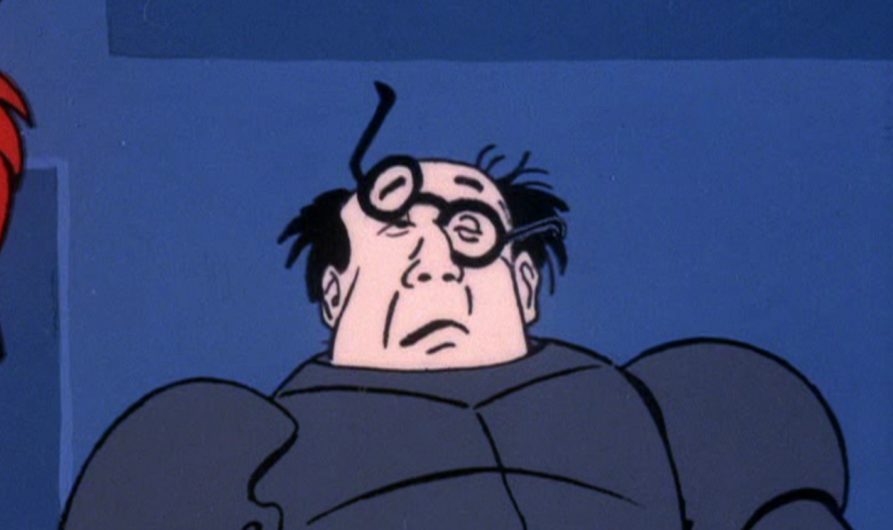

Why WallstreetSwap will Rug Pull
================================
*By github.com/rugpullvigilante 🕵️- discover rug pulls before they happen!*
 

 

  

 ⚠️⚠️⚠️ **TLDR: Take out your money and run for the hills. 💰🏃**⚠️⚠️⚠️
 * Make sure to also revoke permissions for the smart contract

Intro
-----

**When WallStreetSwap was first released, the tokenomics looked amazing to me.**

**Super great APR for Stablecoin Pairs & others alike.**  

Before I tried out the protocol, I wanted to make sure to do my Due Dilligence™️. As you know, that's how people on WSB make money, it's more than just yolo'ing your life savings away, their research community is quite amazing.

So why is it a rug pull? It seems really good, Rug Pull Vigilante
-----------------------------------------------------------------

I'm glad you asked.  

Indeed, this team did everything in their power to hide the fact that they were attempting a rug pull, **in fact, I almost fell for it myself!**

They've removed the migrator exploit, made sure the dev-set function wasn't vulnerable like with IceCreamSwap, etc! Also the pool contracts were audited on launch as well.

### Proof

To make sure we were all good to go, I took one last look at the code for the Pairs, here's what I found:

*   **The initialize function has been altered:**

This approves the "\_factory" param address to spend an unlimited amount of both token. uint(-1) returns the max possible value.

When the WLP pair was created (which contains the liquidity you provided, BUSD-BNB for instance), the initialize gave the feeToSetter address full permissions to take out **all YOUR funds** out of the pairs.

*   **Screenshot showing they have access to all funds in the LP!**

#### Contracts

*   BNB - CAKE Pair
0xc0c12067eAC3f98e8cB4a688EBc11D02D09A4121

*   Their wallet, which has unlimited access to steal funds from the pools
0xA7524EC326D81Dd26765F1BB17AD976d04778304

*   You can confirm they have unlimited access to funds here:
0x0e09fabb73bd3ade0a17ecc321fd13a19e81ce82
 - Use the method 'allowance' and enter owner (PAIR) & spender address (their wallet)

When were they planning to rug pull?
------------------------------------

They probably wanted to wait to gain a TVL as big as possible, before they were exposed. To be able to steal as much funds as possible.

#### I think Scooby-Doo summarizes it best 😎
 

